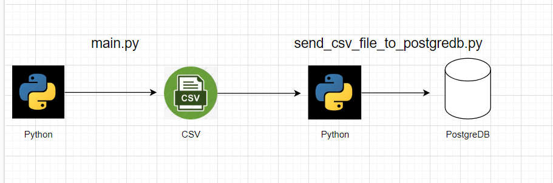

# Pizza Order System

First, classes were created that gave information about pizzas and sauces. Then we read the Menu.txt file with the main.py script and get the order information from the user and print them to the CSV file. Here, records of whether the order was successful or not are kept in the orders.log With send_csv_file_to_postgre_db.py we send it to the PostgreDB database and save it.
